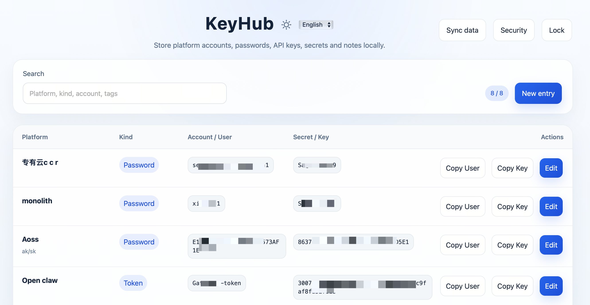

# KeyHub

A desktop password vault focused on purely local master-password mode. Suitable for storing LLM-platform accounts, passwords, API keys, secrets, and notes.


## Features

- **Local-first mode:** create and unlock a local vault using only a master password
- **Stay signed in for 3 days:** optionally remember the master password for 3 days; it expires automatically and requires re-entry
- **Client-side crypto:** derive keys from the master password with **Argon2id** locally; entries encrypted with **AES-256-GCM**
- **Local backup:** export encrypted vault data and reload it from a file
- **Safety UX:** manual lock, idle auto-lock, and timed clipboard clearing after copy
- **UI language:** switch between Chinese (**中文**) and **English** using the dropdown beside the theme control in the header; the choice is persisted under the `localStorage` key `keyhub:locale`

## Project layout

- `src/`: React + TypeScript UI and local data glue
- `src-tauri/src/`: Tauri Rust commands, vault I/O, and crypto
- `src-tauri/app-icon-source.png`: 1024 px desktop icon master; after changes run `npm run icons` to regenerate `.icns` / `.ico` / PNG files under `icons/`
- `src/i18n/`: locale strings and `I18nProvider` (default language follows the system; you can override in-app)
- `src-tauri/scripts/prepare_app_icon_source.py`: letterbox arbitrary aspect-ratio art to a 1024 square (edge-sampled matte) and write `app-icon-source.png`

Use this flow the first time you run the project on a machine.

### 1. System dependencies

You need:

- Xcode Command Line Tools
- Node.js and npm
- Rust and Cargo

Check versions:

```bash
xcode-select -p
node -v
npm -v
rustc -V
cargo -V
```

If `xcode-select -p` prints something like `/Library/Developer/CommandLineTools`, the CLI tools are installed.

If `node` or `rustc` is not found, follow the install steps below.

### 2. Install Node.js

Pick one approach:

**Option A — Homebrew**

```bash
brew install node
```

**Option B — if Homebrew fails, install LTS from nodejs.org or via nvm**

```bash
curl -o- https://raw.githubusercontent.com/nvm-sh/nvm/v0.40.0/install.sh | bash
source ~/.bashrc   # or ~/.bash_profile, whichever exists
nvm install --lts
nvm use --lts
```

- [https://nodejs.org/en/download](https://nodejs.org/en/download)

Open a new terminal and verify:

```bash
node -v
npm -v
```

### 3. Install Rust

Prefer the official **rustup** installer (often more reliable than only Homebrew Rust):

```bash
curl https://sh.rustup.rs -sSf | sh
```

Then load the environment:

```bash
source "$HOME/.cargo/env"
```

Verify:

```bash
rustc -V
cargo -V
```

### 4. Go to the project directory

```bash
cd path/to/KeyHub
```

### 5. Install frontend dependencies

```bash
npm install
```

If you hit network or permission errors, retry; if it still fails, confirm Node/npm are installed correctly.

### 6. Run the desktop app in development

```bash
npm run tauri dev
```

Normally this will:

- start the Vite dev server for the frontend
- open the Tauri desktop window

On first launch you should see the local vault creation screen.

### 7. First-time use

1. Set a master password (**10 characters**; each counts as one, including Chinese and Latin letters), create the local vault, and enter it twice identically.
2. Optionally enable **Remember master password for 3 days**.
3. On the list screen, add platform accounts, passwords, API keys, or secrets.
4. Try copy, search, edit, and open **Security** in the header for auto-lock, clipboard timing, and master-password options. Use **Sync data** → **Export vault** / **Import vault** to exercise local backup flows.

### 8. Build a release installer

After the dev build works:

```bash
npm run tauri build
```

Artifacts appear under `src-tauri/target/`.

### Updating the app icon

```bash
python3 src-tauri/scripts/prepare_app_icon_source.py /path/to/your.png
npm run icons
```

The second command regenerates the files referenced in `src-tauri/tauri.conf.json` under `src-tauri/icons/` (macOS `.icns`, Windows `.ico`, and three PNG sizes).

The source image is clipped to rounded corners proportional to the short side; **areas outside the arc are transparent** (no solid fill matching the Dock/Finder chrome, so corners don’t look like a blunt square). If you already have `app-icon-source.png` and only want to refresh corners:

```bash
python3 src-tauri/scripts/prepare_app_icon_source.py --round-existing
npm run icons
```

## Exporting and importing local data

Labels below match the **English** UI. If your app is in Chinese, the same controls appear as **数据同步**, **导出本地数据**, and **加载本地数据** (or switch the header language to **English** first).

1. Click **Sync data** in the top-right of the main window.
2. Choose **Export vault** — a native save dialog lets you pick folder and filename.
3. To restore, choose **Import vault** and select the backup file.
4. Unlock with the **same master password** that was used for that backup.

When the vault was last left **locked** (manual lock or idle auto-lock), the app will not auto-unlock on the next launch even if “remember password” is enabled, until you enter the master password again on the unlock screen.

## Troubleshooting

### 1. `node: command not found`

Install Node.js (see **Install Node.js** above).

### 2. `rustc: command not found`

Rust is missing or shell env not loaded:

```bash
source "$HOME/.cargo/env"
```

If it still fails, rerun the rustup install.

### 3. Errors from `brew install` mentioning macOS version

Try:

```bash
brew update
brew doctor
```

If Homebrew stays broken:

- install Node.js from the official installer
- install Rust via `rustup`

### 4. `npm run tauri dev` won’t start

Check in order:

1. `node -v`
2. `npm -v`
3. `rustc -V`
4. `cargo -V`
5. that you ran `npm install`

### 5. Cannot unlock after importing local backup

Usually the master password typed now does **not** match the one used when that backup was created.

## Security model

- Data stays on disk locally by default; no cloud dependency for normal use.
- The master password unlocks cached material on the machine; **if the device is fully compromised, plaintext after unlock may still be exposed**.
- This version does **not** integrate the OS keychain and does **not** provide browser autofill.

## Possible next steps

- OS keychain integration
- Multi-factor unlock
- Entry history / conflict merge for sync
- Multi-window or quick-search palette
- Browser extension bridge
