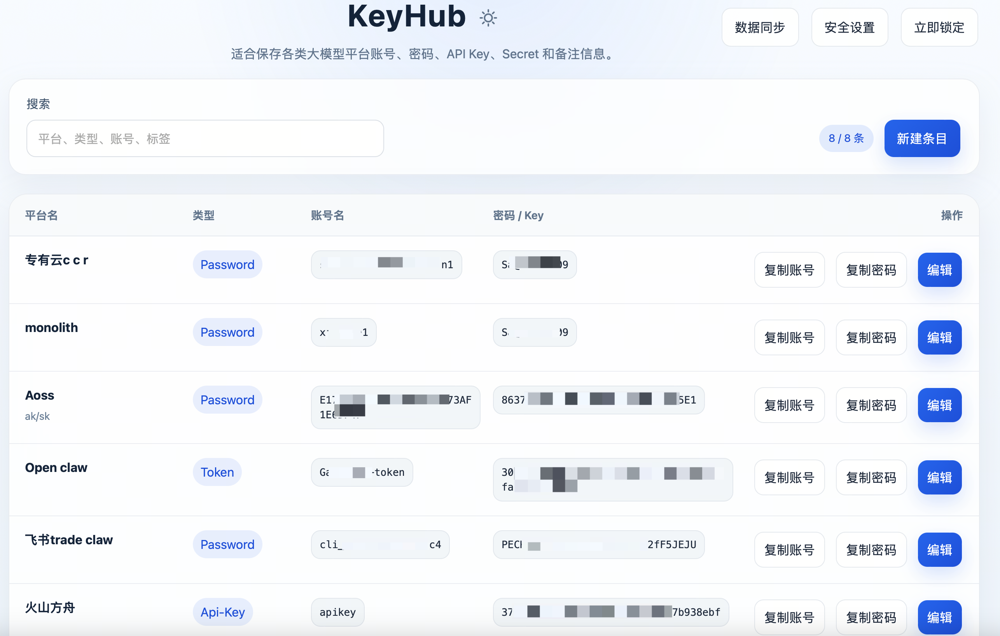

# KeyHub

一个纯本地主密码模式的桌面密码库应用，适合保存各类大模型平台账号、密码、API Key、Secret 和备注信息。


## 功能列表

- 纯本地模式：仅使用主密码创建和解锁本地保险库
- 3 天自动登录：可记住主密码 3 天，到期后自动失效并要求重新输入
- 客户端加密：主密码在本地通过 `Argon2id` 派生密钥，条目使用 `AES-256-GCM` 加密
- 本地备份：支持导出本地加密数据文件，并支持从本地文件重新加载
- 安全体验：支持手动锁定、空闲自动锁定、复制后定时清空剪贴板

## 项目结构

- `src/`：React + TypeScript 前端界面和本地数据交互逻辑
- `src-tauri/src/`：Tauri Rust 命令层、本地保险库存取、加密实现
- `src-tauri/app-icon-source.png`：桌面图标源图（1024×）；更新后执行 `npm run icons` 重写 `icons/` 下的 `.icns` / `.ico` / PNG
- `src-tauri/scripts/prepare_app_icon_source.py`：将任意比例图源 letterbox 到 1024 方形（边缘采样底色），写入 `app-icon-source.png`

## 构建教程

下面这套步骤适合第一次在这台机器上把项目跑起来。

### 1. 系统依赖

当前项目需要：

- Xcode Command Line Tools
- Node.js 和 npm
- Rust 和 Cargo

你可以先检查：

```bash
xcode-select -p
node -v
npm -v
rustc -V
cargo -V
```

如果 `xcode-select -p` 能输出类似 `/Library/Developer/CommandLineTools`，说明命令行工具已经装好了。

如果 `node` 或 `rustc` 提示找不到命令，就继续下面的安装步骤。

### 2. 安装 Node.js

推荐任选一种方式：

方式 A：用 Homebrew

```bash
brew install node
```

方式 B：如果 Homebrew 安装失败，直接去 Node.js 官网下载安装 LTS 版本：

```bash
curl -o- https://raw.githubusercontent.com/nvm-sh/nvm/v0.40.0/install.sh | bash
source ~/.bashrc  # 或者 ~/.bash_profile，看你系统里哪个存在
nvm install --lts
nvm use --lts
```

- [https://nodejs.org/en/download](https://nodejs.org/en/download)

安装完成后重新打开终端，再执行：

```bash
node -v
npm -v
```

### 3. 安装 Rust

推荐使用官方 `rustup`，兼容性通常比直接用 Homebrew 更稳：

```bash
curl https://sh.rustup.rs -sSf | sh
```

安装完成后按提示执行一次：

```bash
source "$HOME/.cargo/env"
```

然后验证：

```bash
rustc -V
cargo -V
```

### 4. 进入项目目录

```bash
cd /Users/xiaokun1/Desktop/workspace/python/KeyHub
```

### 5. 安装前端依赖

```bash
npm install
```

如果这里报网络或权限错误，先重试一次；如果仍失败，再检查 Node.js 是否安装成功。

### 6. 启动桌面开发版

```bash
npm run tauri dev
```

正常情况下会发生两件事：

- Vite 前端开发服务启动
- Tauri 桌面窗口自动打开

第一次启动后，你会看到本地保险库创建页面。

### 7. 首次使用应用

1. 设置 **10 位**的主密码（按字符计，中英文等均算 1 位）并创建本地保险库，两次输入须一致。
2. 可选开启“记住主密码 3 天”
3. 进入列表页后添加平台账号、密码、API Key 或 Secret
4. 测试复制、搜索、编辑，以及安全设置中的本地数据导出 / 加载

### 8. 构建正式安装包

确认开发版能正常运行后，再执行：

```bash
npm run tauri build
```

构建产物会出现在 `src-tauri/target/` 下面。

### 更新应用图标

```bash
python3 src-tauri/scripts/prepare_app_icon_source.py /path/to/your.png
npm run icons
```

第二行会从 `src-tauri/app-icon-source.png` 重新生成 `src-tauri/icons/` 下当前 `tauri.conf.json` 用到的文件（macOS `.icns`、Windows `.ico` 与三张 PNG）。

源图会按短边比例做圆角裁切，**圆角以外为透明像素**（不再用接近背景的实色填角，避免在 Dock/访达里看起来像方块）。若你已有当前的 `app-icon-source.png`、只想补圆角而不换图，可执行：

```bash
python3 src-tauri/scripts/prepare_app_icon_source.py --round-existing
npm run icons
```

## 本地数据导出与加载

1. 在应用中进入右上角 `数据同步`
2. 使用“导出本地数据”后，会打开系统保存对话框，可自定义保存目录和文件名
3. 在需要恢复时点击“加载本地数据”
4. 选择备份文件后，重新输入该备份对应的主密码进行解锁

## 常见问题

### 1. `node: command not found`

说明 Node.js 还没装好，回到上面的“安装 Node.js”步骤。

### 2. `rustc: command not found`

说明 Rust 还没装好，重新执行：

```bash
source "$HOME/.cargo/env"
```

如果还是不行，重新运行 `rustup` 安装命令。

### 3. `brew install` 报 macOS 版本相关错误

先尝试更新 Homebrew：

```bash
brew update
brew doctor
```

如果仍然失败：

- Node.js 改用官网安装包
- Rust 改用 `rustup`

### 4. `npm run tauri dev` 无法启动

按顺序检查：

1. `node -v`
2. `npm -v`
3. `rustc -V`
4. `cargo -V`
5. 是否已经执行过 `npm install`

### 5. 加载本地数据后无法解锁

通常是因为当前输入的主密码与该备份文件对应的主密码不一致。

## 安全边界

- 所有数据默认只保存在本机，不经过云端服务
- 主密码会在本地用于解锁缓存层；如果设备本身已被完全控制，解锁后的明文仍可能暴露
- 当前版本没有集成系统钥匙串，也不支持浏览器自动填充

## 后续可扩展方向

- 系统钥匙串集成
- 双因素认证
- 条目历史版本与冲突合并
- 多窗口或快速搜索面板
- 浏览器插件联动
